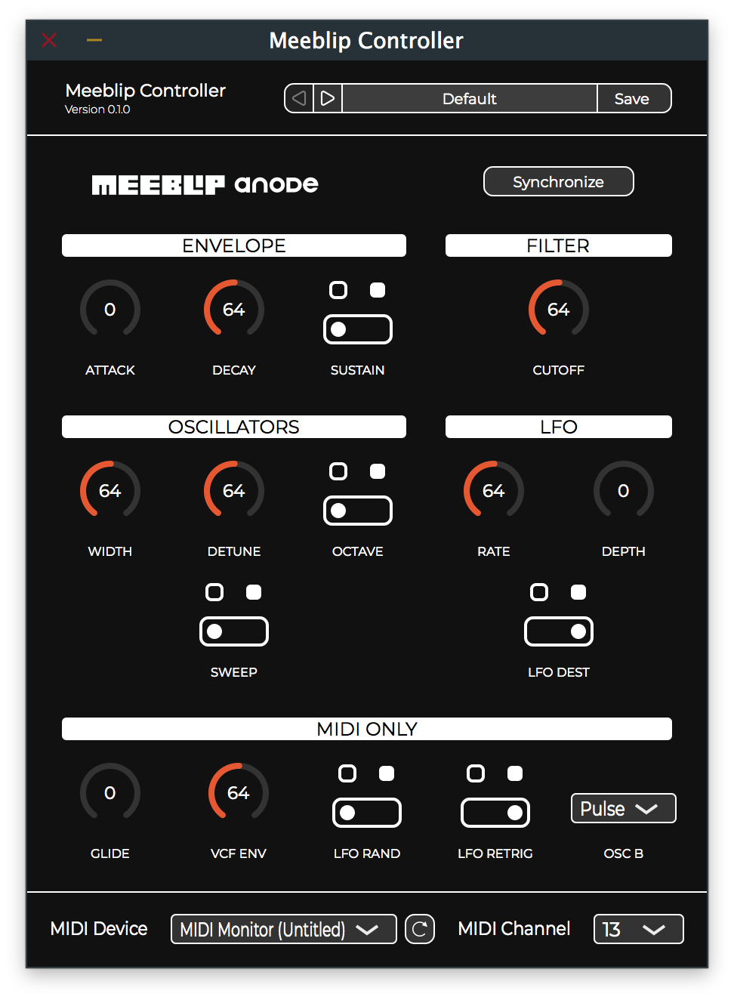

<p align="center">
  
</p>

[](https://travis-ci.org/rclement/meeblip-controller)
[](https://ci.appveyor.com/project/rclement/meeblip-controller)

> Take full control over your Meeblip Anode!

`Meeblip Controller` is a real-time MIDI controller for the [Meeblip Anode](https://meeblip.com/products/meeblip-anode-synth) synthesizer,
available on MacOS and Windows as an audio plug-in (VST, VST3, AU) and a standalone app.

<p align="center">
  
</p>


# Features

Currently supported features:

- Platforms: MacOS, Windows, Linux
- Plug-in formats:
    - VST2 (MacOS, Windows, Linux)
    - VST3 (MacOS, Windows)
    - AudioUnit (MacOS)
- Standalone application
- Real-time parameters interaction
- Access to "hidden" (MIDI only) parameters of the synthesizer
- Synthesizer parameters exported at host level for real-time and offline automations
- One-shot full synchronization with hardware
- Support for MIDI events forwarding to plug-in host (default) or selected external device
- Complete preset system


# Build

## Requirements

- `git`
- `python` >= 3.5
- `cmake` >= 3.4
- `Packages` (MacOS only)
- `XCode` >= 9.0 (MacOS only)
- `InnoSetup` (Windows only)
- `Visual Studio` >= 2017 (Windows only)

For Linux, the following packages are required:

```
git python3 cmake clang freeglut3-dev libasound2-dev libcurl4-openssl-dev libfreetype6-dev libjack-jackd2-dev libx11-dev libxcomposite-dev libxcursor-dev libxinerama-dev libxrandr-dev mesa-common-dev libwebkit2gtk-4.0-dev ladspa-sdk
```

## Automated

```
    python ci/all.py
```

## Manual

1. Checkout submodules

```
    git submodule update --init --recursive
```

2. Build `FRUT`

```
    mkdir -p sdks/frut/build
    cd sdks/frut/build
    cmake .. -DCMAKE_INSTALL_PREFIX=../prefix -DJUCE_ROOT=../../juce
    cmake --build . --target install
    cd -
```

3. Build the plugin

```
    mkdir -p build
    cd build
    cmake .. -G ["XCode" | "Visual Studio 15 2017" | "Unix Makefiles"] -A ["Win32" | "x64"] -DCMAKE_BUILD_TYPE=["Debug" | "Release"]
    cmake --build . --clean-first --config ["Debug" | "Release"]
```

4. Build the installer

- MacOS: `packagesbuild -v build/installer/meeblip-controller.pkgproj`
- Windows: `iscc "build\installer\meeblip-controller.iss"`
- Linux: `sh "build/installer/meeblip-controller.sh"`


# Acknowledgments

This project was inspired by:

- [Meeblip Web Editor](https://editor.meeblip.com)
- [MyBlip Anode](http://www.dr-midik.fr/site/index.php?post/ticket_MyBlip-anode_2014-04-28)

This software makes use of the following third-party software:

- [FRUT](https://github.com/McMartin/FRUT) licensed under GPLv3
- [GRAPE](https://github.com/rclement/grape) licensed under MIT
- [JUCE](https://github.com/WeAreROLI/JUCE) licensed under GPLv3
- [pluginval](https://github.com/Tracktion/pluginval) licensed under GPLv3
- [vst3sdk](https://github.com/steinbergmedia/vst3sdk) licensed under GPLv3

This software makes use of the following third-party graphic material:

- [Meeblip Web](https://github.com/MeeBlip/meeblip-web) licensed under GPLv3


# License

GNU General Public License v3.0

Copyright (c) 2018 Romain Clement

